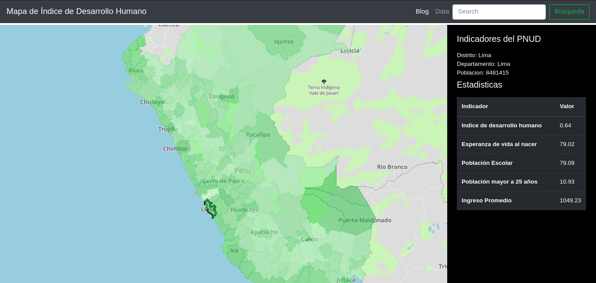

# Mapa de Vulnerabilidad Social

Este mapa nos indica las zonas de mayor vulnerabilidad social haciendo uso de la data del PNUD (Programa de las Naciones Unidas para el Desarrollo).

En este proyecto se uso:

* HTML5
* Javascript
* CSS
* Mapbox
* D3.js